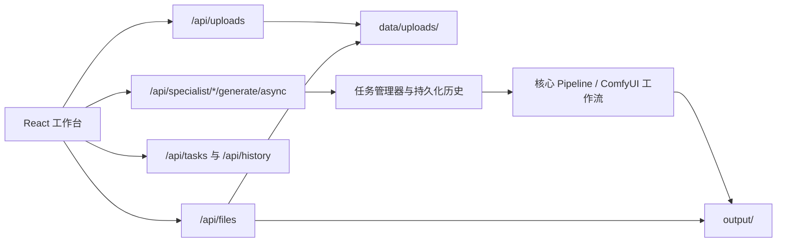

# Streamlit 到 React 全量替代：设计与实施计划

## 状态与目标

状态：已确认执行。目标是让 React 工作台成为唯一生产前端，在 Docker 和本地启动链路中替代 Streamlit，并在验收后删除 Streamlit 代码、依赖、脚本和文档入口。

本次迁移的范围是现有五条生产路径：快捷创作、自定义素材混剪、图生视频、动作迁移、数字人。快捷创作已使用 FastAPI，保留并回归验证。后四条专项路径必须从“React 展示页”变成真实的上传、提交、进度、历史、下载和失败恢复链路。

不做事项：不改变已验证的标准视频生成参数语义，不重写核心视频/ComfyUI 工作流，不在本次增加用户账户或远程对象存储。

## 现状与关键决策

1. `web/` 仍是可执行的 Streamlit 前端，并包含四条专项工作流的真实调用。
2. React 的专项页目前含模拟素材或模拟行为；统一提交会在 `frontend/src/lib/api.ts` 中固定为 `pipeline: "standard"`。
3. FastAPI 仅暴露标准视频生成任务，缺少文件上传与专项任务端点。
4. 迁移采用“先后端契约，后 React 接入，最后部署与删除”的垂直切片。每条专项路径在替代完成且端到端验收前保留 Streamlit 作为回退。

## 目标架构

上传资源与生成结果分别存放。上传文件保留在 `data/uploads/`，以便历史记录和恢复任务仍可访问原始素材；最终视频和分镜继续使用 `output/<task-id>/`。所有客户端传入的路径都只能是服务端签发的上传标识或白名单资源键，不能接受任意本地绝对路径。

## API 契约

### 公共上传

`POST /api/uploads?purpose=<purpose>`，multipart `files[]`。

支持的 purpose：

| purpose | 允许格式 | 调用方 |
|---|---|---|
| `custom-media` | jpg/jpeg/png/gif/webp/mp4/mov/avi/mkv/webm | 自定义素材 |
| `image-to-video` | jpg/jpeg/png/webp | 图生视频 |
| `action-transfer-video` | mp4/mkv/mov | 动作迁移驱动视频 |
| `action-transfer-image` | jpg/jpeg/png/webp | 动作迁移主体图 |
| `digital-human-character` | jpg/jpeg/png/webp | 数字人角色 |
| `digital-human-product` | jpg/jpeg/png/webp | 数字人商品图 |

响应至少包含 `upload_id`、`files[]`、每个文件的稳定 `file_key`、名称、MIME 类型、大小和可预览的 `url`。单文件大小和批次总大小由服务端限制；保存时使用服务端生成文件名，原始文件名仅作展示。上传失败必须返回 4xx，并且不留下半写入文件。

### 专项生成

四个异步端点使用已有任务模型和进度格式，并新增可序列化的请求模型：

| endpoint | 关键输入 | 后端执行 |
|---|---|---|
| `POST /api/specialist/custom-media/generate/async` | `asset_file_keys`、标题、意图、时长、TTS、BGM | `AssetBasedPipeline` |
| `POST /api/specialist/image-to-video/generate/async` | 单张 `image_file_key`、提示词、工作流 | 迁出 Streamlit 的图生视频执行器 |
| `POST /api/specialist/action-transfer/generate/async` | `video_file_key`、`image_file_key`、提示词、时长、工作流 | 迁出 Streamlit 的动作迁移执行器 |
| `POST /api/specialist/digital-human/generate/async` | 角色/商品上传键、模式、文案、TTS、工作流 | 迁出 Streamlit 的数字人执行器 |

所有端点必须在创建任务前验证上传键的 purpose 和存在性。任务 `request_params` 记录上传键和用户选择，结果写入现有历史系统，失败信息、最终视频 URL 和分镜/素材信息可由 `GET /api/tasks/{id}`、`GET /api/history/{id}` 返回。恢复端点只对具备可恢复语义的专项任务开放；不安全或不可重放的任务明确返回 409，而不是伪装为已恢复。

## 分阶段实施

### Phase 0：基线与文档

- 写入本设计与实施文档。
- 保留当前未提交的 React 修改，不覆盖、不格式化无关文件。
- 基线：`npm run lint`；设置 `PYTHONUTF8=1` 后运行相关 pytest。

### Phase 1：公共上传与文件访问

涉及：`api/schemas/uploads.py`、`api/routers/uploads.py`、`api/app.py`、`api/routers/files.py`、上传 API 测试。

完成条件：各 purpose 仅接受规定后缀，文件以服务端生成的路径保存至 `data/uploads/`，返回的预览 URL 可访问，路径穿越和不匹配 purpose 被拒绝，失败上传没有遗留完整文件。

### Phase 2：专项服务与异步 API

涉及：`api/schemas/specialist.py`、`api/routers/specialist.py`、`pixelle_video/services/specialist_*`（或已存在核心 pipeline）、任务与历史适配、单元测试。

实施顺序：

1. 自定义素材。已有 `AssetBasedPipeline`，只需提取请求映射和任务/历史桥接。
2. 图生视频。把 `web/pipelines/i2v.py` 的执行逻辑移至无 Streamlit 依赖的服务。
3. 动作迁移。把 `web/pipelines/action_transfer.py` 的执行逻辑移至服务，并验证视频+图片输入。
4. 数字人。把 `web/pipelines/digital_human.py` 的模式选择、TTS 和工作流调用移至服务。

每条链路先写 API 层测试，验证请求校验、任务创建、进度映射和失败传播；再以 mock 核心服务验证真正参数被传递，避免仅测试 HTTP 200。

### Phase 3：React 真实接入

涉及：`frontend/src/lib/api.ts`、四个专项组件、`App.tsx`、类型、组件测试。

- 用原生 file input 或现有组件包装真实 multipart 上传，删除 Unsplash 初始素材、`Mock`、`Simulated` 和 `setTimeout` 伪行为。
- 只在上传成功后允许提交，提交专项端点而非标准视频端点。
- 用 API 返回的文件 URL 显示本地预览；真实任务 ID 接入既有轮询、控制台、历史、下载与错误提示。
- 数字人的头像/背景/模式选择必须进入提交载荷，不能只是视觉状态。

### Phase 4：生产交付与 Streamlit 下线

- Docker 使用 Node 构建阶段生成 React 静态产物，由 FastAPI 托管 SPA 和 `/api`。
- `docker-compose.yml` 删除 Streamlit `web` 服务和 8501 暴露，仅保留 API/React 服务。
- 本地启动脚本默认启动 API/React，开发模式保留 `frontend npm run dev` 的代理说明。
- 更新中英文 README、快速开始、架构文档、Windows 打包模板和 NOTICE；从 `pyproject.toml` 与锁文件移除 Streamlit。
- 删除 `web/`、`start_web.*`、`Start Pixelle-Video.command` 中的 Streamlit 启动逻辑，以及只被这些文件使用的测试/辅助模块。

删除只在下面所有验收项通过后进行，且以一个单独、可回滚的提交完成。

## 验收矩阵

| 链路 | 自动验收 | 人工端到端验收 |
|---|---|---|
| 快捷创作 | 现有请求载荷、进度、预设测试 | 文案到成片、历史、下载 |
| 自定义素材 | 上传 purpose、请求映射、`AssetBasedPipeline` mock、任务失败 | 多图与视频素材，预览、成片、历史 |
| 图生视频 | 图片上传、工作流参数、任务进度 | 上传图片，生成和下载成片 |
| 动作迁移 | 视频/图片校验、工作流参数、失败传播 | 上传两类素材，生成和历史恢复策略 |
| 数字人 | 模式/角色/商品/TTS 参数映射 | 角色或商品模式，口播、成片、下载 |
| 部署 | React build、API tests、Compose 配置校验 | `docker compose up` 后仅通过 8000 访问工作台 |

每条专项链路最低通过标准：真实文件上传，不使用远程示例 URL，不使用模拟延迟；返回真实任务 ID；控制台显示后端进度；成功后可在历史中播放和下载；失败显示后端错误且不误报成功。

## 风险与控制

- Streamlit 专项逻辑当前直接调用内部对象。迁移时先提取无 UI 依赖服务，禁止在 FastAPI 路由中复制大段页面代码。
- 上传目录会占用磁盘。首版限制类型和大小，并在后续任务清理策略中加入上传引用清理，不能随意删除仍被历史任务引用的文件。
- GPU/云工作流无法在单元测试环境执行。单测使用 mock 验证参数与状态机，正式验收在具备配置的环境中跑完整任务。
- 现有 React 工作区有未提交修改。本迁移只触及与专项链路直接相关的文件，合并前需复核差异归属。

## 本轮执行清单

1. 完成 Phase 1 的上传模型、路由、文件访问白名单与测试。
2. 完成自定义素材专项 API 的请求模型、任务桥接和测试。
3. 将 React 自定义素材页从模拟素材替换为真实上传与专项提交。
4. 逐条完成其余三条专项路径后，再进入部署和删除阶段。

