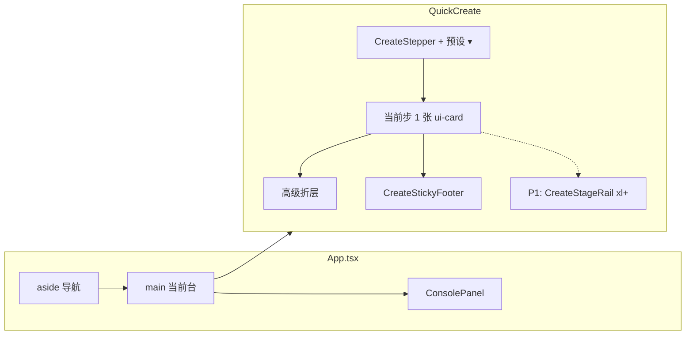
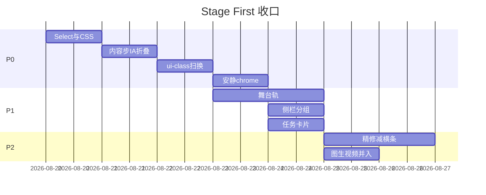

# 05 · Stage First 缺口收口执行计划

**作者**：PixVideo frontend  
**日期**：2026-08-20  
**状态**：Ready（评审 0 open issues；P0 从 PR-H 开工）  
**类型**：前端-only 执行叠加层（continuation / execution overlay）  
**原则源**：`docs/ux-ui-redesign/01-design-principles.md` · `02-wireframes-create-edit.md` · `03-component-spec.md`  
**前序实施**：`04-implementation-plan.md` PR-A–F 已合并 token / 壳 / 步进器 / 工作台舞台 / 作品库 / 设置；**本文只收口仍违反原则的现网缺口**，不重写原则。

---

## Overview

`04` 的 A–F 把 Soft Dark 的 **token、壳、四步步进器、工作台 `ui-stage`、作品库卡片、设置卡片** 铺进了代码，但快捷创作主路径（`QuickCreate.tsx` ~4300 行）仍是「蜂窝锌板」：大量 `border-zinc-800` / `bg-[#17181c]` / `text-[10px]` 一次性控件，内容步把主题、文案、字数、导演、切分、高亮抽词、预设 CRUD、多个 CTA 堆在同一屏。结果是：**有原则、有 class、没有 Stage First / One Focus**。

本文把已批准评价（操作丝滑 · 交互极好 · 审美极高 · 简洁有高级感）锁成可执行批次：

- **P0（立刻编码）**：内容步瘦身（次要字段折叠、不删功能）+ 全表单 `ui-*` 控件统一 + 安静 chrome。
- **P1**：xl+ 常驻预览舞台轨；侧栏分组改为 创作 / 作品 / 设置（**不改 `ActiveTab` key**）；任务面板改卡片。
- **P2**：精修台减少常驻横条；图生视频并入创作方式（**不删 `ImageToVideo.tsx` / API**）。

零 API / 零 payload 字段改名。工程师按「文件清单 → 结构搬迁 → class 替换 → 契约测试 → 浏览器 QA」即可落地。

---

## Background & Motivation

### 当前产品形态（现网）

PixVideo 前端：`frontend/` React + Vite，构建产物 `frontend/dist`，由 FastAPI 静态托管。两条生成路径不变：

| 路径 | 入口 | 服务 |
|------|------|------|
| 快捷创作 | `QuickCreate` → `handleTriggerRender` | 异步 StandardPipeline（`submitVideoTask`）或 `onCreateProject` |
| 精修 | `ProjectWorkbench` | `ProjectGenerationService` + `WorkbenchJobService` |

壳：`frontend/src/App.tsx`，`ActiveTab` = `quick-create | image-to-video | project-workbench | history | settings`。

### 痛点（对照现网 JSX，不是对照 04 勾选）

1. **Token 落地 ≠ 控件落地**。`index.css` 已有 `.ui-card` `.ui-btn*` `.ui-input` `.ui-chip` `.ui-stage`（PR-A），但 `QuickCreate.tsx` 仍有 **46 处 `border-zinc-800` 匹配行、87 处 `text-[10px]`**（`frontend/src` 合计 **53 行** `border-zinc-800`，含 QC 46 + 其它 7 文件行）。另有大量 `border-zinc-850/900/750`、`bg-[#17181c]` / `bg-[#101114]` / `bg-[#0c0d10]` / `bg-[#121316]`。`Select.tsx` 触发器还用 `!bg-[#17181c] !border-zinc-700/80` **覆盖**调用方 class。
2. **内容步过载**。`id="stage-content"` 标题+预设 CRUD 一张卡，外面再一张「创作方式」，再 `id="stage-storyboard"` 塞主题 / 口播 / 高亮抽词 / 字数 / 导演模式 / 切分 / 实时分镜列表 / 「生成口播稿」+「按当前导演设置生成分镜」。违反 P2 One Focus。
3. **预览不是舞台**。内容步的分镜列表是挤在表单里的 `max-h-40` 小盒；xl 没有右侧 `ui-stage`。精修台虽有 `ui-stage`，顶栏 + 导出完成条 + 快捷键条 + 批量条仍可叠成 3–4 条全宽 chrome。
4. **侧栏仍像控制台**。已改展示文案（开始创作 / 精修 / 作品库 / 设置），但图生视频是与快捷创作平级的 peer tab；「项目」分组把精修和设置混在一起；顶栏常驻 LLM|图像胶囊。
5. **任务面板是日志墙**。`ConsolePanel.tsx` 仍是 `text-[10px] font-mono` 网格步骤 + `text-[8px] OK/RUN`。最近队列行已用 surface token（**不存在** `.ui-surface` class）；主监视区仍是 dump。

### 04 勾选 vs 现网（必须显式说破）

| 04 条目 | 勾选 | 现网事实 |
|---------|------|----------|
| PR-A token / `.ui-*` | ✅ 2026-08-10 | **真落地**于 `index.css` |
| PR-B 壳 + 状态默认折叠 | ✅ 2026-08-11 | **真落地**：`statusExpanded` 默认 `false`，`navBtn` 已 amber ring |
| PR-C 四步 + Stepper + sticky footer | ✅ 2026-08-11 | **骨架落地**；主卡片外仍是蜂窝控件；04 自己留了未勾：「关键词更深折叠」「xl 右侧摘要」 |
| PR-D 精修 `ui-stage` + 项目设置抽屉 | ✅ | **大部分落地**；HUD `text-[10px]`、导出完成条与快捷键条仍抢舞台 |
| PR-E / F 作品库、设置 | ✅ | 明显好于 QuickCreate |
| PR-G `components/ui/Button.tsx` 等 | ❌ | 本执行层 **不强制做组件库**；继续用 CSS class（03 允许） |

**结论**：04 的「步骤化」完成了信息架构骨架，没有完成视觉系统在 QuickCreate 内的替换。这是本文存在的理由。

---

## Goals & Non-Goals

### Goals

- 操作丝滑、单焦点：每向导步 **1 个主任务 + 1 个主 CTA**。
- UI 简洁有高级感：面分层、少描边、琥珀仅用于主 CTA / 当前步 / 进行中。
- 能力全部可达：折叠，不删除。
- 宽屏创作流预览成为舞台（P1）。
- 导航按用户任务分组：创作 / 作品 / 设置（P1 展示层）。

### Non-Goals（强制）

- 不改 API、后端、生成管线、TTS/字幕算法、分镜 pack 规则。
- 不改 `handleGenerateCopyDraft` / `handleTriggerRender` / `handleAIGenerateScript` 的 **请求 body 字段名**。
- 不改 `ActiveTab` 枚举值（除非后续 PR 显式做 key 映射表；P0/P1 只改展示与 DOM 分组）。
- 不删 `ai | manual | batch`；不删双引擎（Quick Create + Workbench）。
- 不把高亮词编辑器迁回风格步；风格步保持只读 chips +「去内容里改词」。
- 不改 `WIZARD_STEPS` id（`content | style | voice | review`）。
- 不在 P0/P1 删除 `ImageToVideo.tsx` 或图生视频 API。
- 不把产品功能删除权交给执行者（折叠入口必须可发现）。

---

## Key Decisions

1. **本文是 01–04 的执行叠加，不是第二套设计系统。** 只用 `index.css` 已有 token 与 `.ui-*`；P0 仅允许新增 **一个** 规范内 class：`.ui-segment`（03 §3.5 已描述、尚未落 CSS）。禁止再发明 `--color-*`。
2. **P0 内容步：主舞台 = 主题 + 确认文案 + 一个生成 CTA；其余折叠。** 比 02 线框「三列工具条常显」更狠——以用户已批准评价为准。工具条（字数 / 导演 / 切分）进「高级设定」。一行只读摘要常显（「约 N 镜 · 约 Xs」），详细 `<ol>` 进高级，P1 再搬到右侧舞台轨。
3. **高亮词三层，且只在内容步编辑。** `#keyword-extraction` / `renderKeywordExtractionPanel` 仍是唯一编辑器；风格步只读 chips +「去内容里改词」。分层见下文「高亮三层」，不要把已选词列表和色盘绑在同一个展开条件上。
4. **预设 CRUD 移出内容主卡，进入 Stepper 头。** 与 02「预设 ▾ · 专家模式」对齐。菜单展示文案改为「预设」；`ConfirmModal` 标题保持「删除工作台预设？」（`test_quick_create_presets.py` 可继续用该子串）。handler 不改。
5. **专家模式 = 四步同时可见，且 DOM 顺序必须是 内容→风格→声音→确认。** 现网 JSX 把 voice（~L3002）放在 style（~L3514）之前，专家模式会看到「内容→声音→风格→确认」。**PR-I 专门 commit 把 style 块剪切到 voice 之前**（不改 state）。进入专家：打开全部高级折层；**退出专家不强制关闭**已打开的高级。
6. **不改路由 key。** 侧栏 P1 只改分组标题与 DOM 顺序：创作（开始创作 / 精修 / 图生视频）· 作品（作品库）· 设置。
7. **Select 必须先修（触发器 + listbox）。** `Select.tsx` L136 `!bg-[#17181c]` 与 L147 下拉 `bg-[#17181c]/98` 同一 PR-H 换皮，否则 ui-input 统一仍像锌板。
8. **P0 不拆 `QuickCreate.tsx` 为四个 Step 文件。** 只：分区注释 + 折叠 DOM + class 替换 + `AdvancedFold.tsx`（受控 button，**不用** native `<details>`）。
9. **图生视频 P2 才并入创作方式 chip。** 经 App 回调：`QuickCreate` 新增 `onOpenImageToVideo?: () => void`，`ImageToVideo` 新增 `onBackToCreate?: () => void`。**禁止** `createView` state，禁止 QuickCreate 内部 `setActiveTab`。P0/P1 不删 `ImageToVideo.tsx` / API；P2 才可隐藏侧栏该项。
10. **契约测试改绑行为与关键中文，不绑 zinc class。** 已红与将红清单见 §测试。不要为测试把死文案加回去。
11. **内容步唯一实心琥珀由一张矩阵锁定；底栏 variant 只跟 `contentReady`。** 见 CTA 矩阵。删除任何「仍 primary 之一」。不新增 `contentPrimaryReady`。
12. **成片规格保持现有 `IMAGE_SIZE_PRESETS` Select，只换皮。** 禁止收成 9:16/16:9/1:1 三枚 chip（会改变默认分辨率，属 payload 邻接变更）。
13. **`expertMode` 仅 session。** 现网 `QUICK_CREATE_DRAFT_KEY` JSON（L654–700）**不含** `expertMode`；P0 不写入草稿。
14. **P0 声音步 = 只换 class。** 不折叠 TTS 引擎、不折叠「多镜配音交付 / Qwen 设计 / 克隆」。那些折层推迟 P1。
15. **TTS 按钮文案与手动分镜中英标签视为契约字符串。** P0 class 扫换不缩短「Edge 极速 / MiniMax 精致…」，不改「分镜配音旁白 (TTS Text)」等；要改必须同 PR 改测试。

---

## Gap analysis vs 01–04（引用现网）

### 已落地（不要重做）

| 层 | 文件 | 证据 |
|----|------|------|
| Token | `frontend/src/index.css` `@theme` | `--color-surface-0..4`、`--radius-*`、`--shadow-soft/stage/cta`、`.ui-card/.ui-btn/.ui-input/.ui-stage/.ui-chip/.ui-sticky-footer` |
| 壳 | `App.tsx` | `aside` `w-60` `bg-[var(--color-surface-1)]`；`navBtn` amber ring；`statusExpanded` 默认 `false`；展示文案「开始创作 / 精修 / 作品库 / 设置」 |
| 向导骨架 | `quickCreate/wizard.ts` | `WIZARD_STEPS` 四 id 未变 |
| 步进 / 底栏 | `CreateStepper.tsx` `CreateStickyFooter.tsx` | 四步 + sticky 主 CTA `ui-btn-primary` |
| 精修舞台 | `ProjectWorkbench.tsx` ~L968–1222 | 单行 TOPBAR、`ui-stage`、圆形播放、项目设置抽屉、批量条仅多选出现 |
| 作品库 / 设置 | `HistoryList.tsx` `SystemSettingsTab.tsx` | 卡片网格 / `ui-card`+`ui-input` |
| 图生视频 | `ImageToVideo.tsx` | 已用 `ui-card`+`ui-input`+`ui-btn-primary`（比 QuickCreate 更接近规范） |

### 仍违反原则（P0–P2 要修）

| 原则 | 违反点 | 现网位置 |
|------|--------|----------|
| P1 Stage First | 创作流无常驻舞台；分镜预览是表单内小列表 | `QuickCreate.tsx` L2734–2754 |
| P2 One Focus | 内容步同时出现：标题、预设 4 按钮、三模式、主题、口播、高亮、字数、导演、密度、切分、两个生成按钮 | `stage-content` + `stage-storyboard` L2317–2800 |
| P4 Surfaces over Strokes | 每个 input/chip/按钮一圈硬边 | QuickCreate `border-zinc-800` **46 行**；`Select.tsx` L136+L147 |
| P6 Brand Restraint | 顶栏 LLM 胶囊、创作前检查三 chip、Stepper 当前步、主 CTA、高亮抽词按钮 **同时** 用琥珀 | `App.tsx` L922–945；`QuickCreate.tsx` L2264–2297、L2756 |
| P7 Type Scale | 87× `text-[10px]`，另有 `text-[9px]`/`text-[8px]`/`text-[11px]` | QuickCreate、ConsolePanel、CreateStepper 圆点 |
| P8 Quiet Feedback | 服务状态侧栏已折叠，但创作页横幅 + 顶栏胶囊重复同一信息 | `App.tsx` header + QuickCreate readiness |

### 现网内容步真实结构（before）

```
QuickCreate (max-w-[1240px], pb-28)
├── 草稿恢复条 / 快速上手条 / 创作前检查条   ← 最多 3 条横幅
├── CreateStepper
├── [content]
│   ├── #stage-content.ui-card     标题 + 预设 Select + 覆盖/另存/更多
│   ├── 创作方式 3 格（自身 border-zinc-800）
│   └── #stage-storyboard.ui-card
│       ├── 主题 textarea 蜂窝
│       ├── 文案方式 + 口播 textarea + #keyword-extraction
│       ├── 3 列：字数 | 导演模式+密度+目标镜数 | 切分规则
│       ├── 实时分镜 <ol>
│       └── CTA：「生成口播稿」或「重新写口播稿」+「按当前导演设置生成分镜」
├── [style] 画幅/API 开关/高级前缀/字幕细调/工作流蜂窝卡
├── [voice] TTS 5 段 + BGM 双列蜂窝
└── [review] 核对卡 + CreateStickyFooter
```

主 CTA 冲突（现网）：无草稿时卡片「生成口播稿」是生琥珀；有草稿时「按当前导演设置生成分镜」是 `ui-btn-primary`（L2788），底栏「下一步」也是 `ui-btn-primary`。P0 以 CTA 矩阵为准，同一屏最多一张实心琥珀来自「卡片生成」**或**「底栏下一步」（见矩阵；底栏是否 primary 只看 `contentReady`）。

---

## Proposed Design

### 总架构（P0 后仍是同一组件树）



### 分阶段范围



---

## 内容步信息架构（Before / After）

### 字段归属（不删任何 state）

| 字段 / UI | State | P0 默认可见 | 折叠到 | 自动展开条件 |
|-----------|-------|-------------|--------|----------------|
| 项目标题 | `title` | 是 | — | — |
| 创作方式 ai/manual/batch | `mode` | 是 | — | — |
| 主题 | `aiTopic` | 是（ai） | — | — |
| 口播/分镜草稿 | `copyDraft` `copyDraftMode` | 是 | — | — |
| 主 CTA 生成口播/分镜旁白 | `handleGenerateCopyDraft` | 无草稿时是 | — | 见 CTA 矩阵；**不是**「仍 primary 之一」 |
| 高亮 A 层 | `renderKeywordExtractionPanel` | 是 | — | 标题、状态行、AI 抽词、已选词 compact chips（无色盘） |
| 高亮 B 层「抽词选项」 | `showAdvancedKeywords` + 风格/密度/`autoExtract`/换一批/全部应用/色盘/逗号编辑器 | 否 | 抽词选项 | 见高亮三层：suggestions>0 或非默认 style/density 或 `autoExtract===false`。**不**因 `highlightWords.length>0` 打开 |
| 文案总字数 / 左右|以内 | `copyCharCount` `copyCharCountMode` | 否 | 高级设定 | `copyCharCount !== 200` 或 `copyCharCountMode !== "around"` |
| 导演模式 / 密度 / 目标镜数 | `directorMode` `storyboardDensity` `aiSceneCount` | 否 | 高级设定 | `directorMode !== "auto"` 或 `storyboardDensity !== "standard"` |
| 切分规则 | `splitType` | 否 | 高级设定 | `splitType !== "auto"` |
| 实时分镜详细列表 | `liveStoryboardPreview` | 否 | 高级设定（P1 起镜像到右轨） | 列表 length>0 **不**作为展开条件；只留一行摘要在主卡 |
| 一行摘要「约 N 镜 · 约 Xs」 | 派生 | 是 | — | N = `liveStoryboardPreview.length \|\| suggestedSceneCount \|\| "—"`；S = `estimatedStoryboardSeconds ?? estimatedCopySeconds`；可附「自动导演」caption |
| 「重新分析」「采用语义」「采用节奏」 | 现 L2644–2687 | 否 | 高级设定，紧挨导演控件 | **handlers 原样搬迁，禁止丢掉** |
| 「按当前导演设置生成分镜」 | `handleAIGenerateScript` | 有草稿后可见 | — | **始终 secondary**（见 CTA 矩阵） |
| 预设 CRUD | `presetNameDraft` 等 | 否（移到 Stepper 头菜单） | 预设 ▾ | — |
| 手动分镜编辑器 | `scenes` | 是（mode=manual） | — | — |
| 批量主题列表 | `batchInput` | 是（mode=batch） | — | — |
| 创作前检查横幅 | `readinessIssues` | **仅当 issues.length>0** | — | — |
| 快速上手条 | `showCreateTip` | 保持可关 | — | — |

**不要用 `copyCharCountTouched === true` 做自动展开**——现网默认就是 `true`（L361），会让高级区永远打开。

### CTA 矩阵（内容步，唯一锁定；删掉「仍 primary 之一」）

**定义**

- `hasDraft` = `Boolean(copyDraft.trim())`（只用于卡片生成按钮，**不是**底栏）。
- `contentReady` = **现网原样** `Boolean(title.trim()) && buildScenesForRender().length > 0`（L2148）。缺标题时即使有口播也不 ready。
- **底栏「下一步」variant 永远跟 `contentReady`**：`contentReady` → `ui-btn-primary`，否则 `ui-btn-secondary`。点击仍走 `handleWizardNext`。不新增 `contentPrimaryReady`。
- 同一内容步：**卡片生成按钮**在 `mode==="ai" && !hasDraft` 时是唯一卡片实心琥珀；有草稿后卡片上不再出现 primary。底栏是否 primary 与卡片独立，只看 `contentReady`（ai 空草稿且尚未切出分镜时 `contentReady` 通常为 false，故不会出现两颗实心琥珀）。
- 专家模式：底栏 `showSubmit` 逻辑保持现 `CreateStickyFooter`；内容卡按钮仍按本表。提交主 CTA 在 review/expert 时仍是「生成初稿并打开工作台」。

| mode | hasDraft | copyDraftMode | 卡片唯一 `ui-btn-primary` | 卡片 secondary | 底栏「下一步」 |
|------|----------|---------------|---------------------------|----------------|----------------|
| ai | 否 | `full` | **生成口播稿**（`handleGenerateCopyDraft`） | 无 | `contentReady` ? primary : secondary |
| ai | 否 | `segmented` | **生成分镜旁白**（同一 handler） | 无 | 同上 |
| ai | 是 | * | **无**（禁止卡片 primary） | 「重新写口播稿」+「按当前导演设置生成分镜」**都是** `ui-btn-secondary` | `contentReady` ? primary : secondary（缺标题时 secondary） |
| manual | * | — | 无 | 「新增分镜」secondary | `contentReady` ? primary : secondary（默认两镜+标题 → 通常 primary） |
| batch | * | — | 无 | 无生成口播 | 同上（有主题行即可 ready） |

按钮短文案锁定：无草稿 `full` →「生成口播稿」；无草稿 `segmented` →「生成分镜旁白」。**不要**把「草稿」写回按钮（toast 可继续「AI 正在生成口播稿草稿...」）。有草稿后的分镜按钮文案保持「按当前导演设置生成分镜」或可缩短为「生成分镜」，同 PR 更新测试即可。

### 自动展开实现（上升沿；永不自动关闭）

**不要**把 `if (hasNonDefault) setOpen(true)` 写进依赖 `hasNonDefault` 的 effect——非默认期间每次 render 都会撬开用户刚收起的折层。

```ts
const contentAdvancedHasNonDefault =
  copyCharCount !== 200 ||
  copyCharCountMode !== "around" ||
  directorMode !== "auto" ||
  storyboardDensity !== "standard" ||
  splitType !== "auto";

const prevNonDefaultRef = useRef(false);
const prevExpertRef = useRef(false);
const skipNextNonDefaultRiseRef = useRef(false); // 用户在当前非默认「段」里手动收起后，忽略本段内的上升沿

const openContentAdvanced = () => setContentAdvancedOpen(true); // 只开不关

useEffect(() => {
  const expertRose = expertMode && !prevExpertRef.current;
  prevExpertRef.current = expertMode;
  if (expertRose) {
    setContentAdvancedOpen(true);
    setShowAdvancedProduction(true);
    setShowAdvancedKeywords(true);
    skipNextNonDefaultRiseRef.current = false;
  }
  // 退出专家：不 set false，折层保持用户离开时的开合
}, [expertMode]);

useEffect(() => {
  const rose = contentAdvancedHasNonDefault && !prevNonDefaultRef.current;
  prevNonDefaultRef.current = contentAdvancedHasNonDefault;
  if (rose && !skipNextNonDefaultRiseRef.current) {
    openContentAdvanced();
  }
  if (!contentAdvancedHasNonDefault) {
    skipNextNonDefaultRiseRef.current = false; // 回到默认后，下一次非默认允许再自动打开
  }
}, [contentAdvancedHasNonDefault]);

const onToggleContentAdvanced = (next: boolean) => {
  setContentAdvancedOpen(next);
  if (!next && contentAdvancedHasNonDefault) {
    skipNextNonDefaultRiseRef.current = true; // 本段非默认期间不再自动撬开
  }
  if (next) skipNextNonDefaultRiseRef.current = false;
};
```

草稿/预设 hydrate 成功后：若 `contentAdvancedHasNonDefault`，调用一次 `openContentAdvanced()`（视为一次合成上升沿），然后把 `prevNonDefaultRef` 设为当前值，避免紧接着的 effect 再打开一次。

**永不**因 `hasNonDefault` 变 false 或退出专家而 `setContentAdvancedOpen(false)`。

`showAdvancedKeywords`（高亮 B 层）**复用同一套**上升沿 + skip + hydrate，**不要**写成 `if (suggestions.length) setShowAdvancedKeywords(true)`（suggestions 仍在时每次 render 都会撬开，即现网 L1010 的搬家版）。键是下面这个布尔，**不**含 `highlightWords.length`：

```ts
const keywordsAdvancedHasNonDefault =
  aiKeywordSuggestions.length > 0 ||
  keywordPreferences.style !== "balanced" ||
  keywordPreferences.density !== "standard" ||
  keywordPreferences.autoExtract === false;

// prevKeywordsNonDefaultRef / skipNextKeywordsRiseRef 与上同构
// hydrate：草稿/预设若 style/density 非默认或 autoExtract===false，打开 B 一次并写 prev
// 专家进入已在上面的 expertRose 里 setShowAdvancedKeywords(true)
```

### 高亮三层（`#keyword-extraction`）

现网 L1010 在 `highlightWords.length>0` 或 `autoExtract && suggestions.length>0` 时展开**整块**内层（推荐 chips + 已选编辑器 + 色盘），这会让「抽词选项默认关」几乎一选词就失效。P0 拆成：

| 层 | 默认 | 内容 |
|----|------|------|
| **A 常显** | 开 | 标题「字幕高亮词（可选）」；状态行（idle/loading/stale/error/ready 文案保持）；按钮「AI 抽词」；**已选词 compact chips**（只展示词，点 chip 不打开色盘；删除可用 chips 上的 ×） |
| **B 抽词选项** | 关 | 抽取风格、抽取密度、「生成文案后自动抽词」、AI 推荐列表、「全部应用」、「换一批」、逗号分隔 textarea、每词色盘 |
| **C 自动打开 B** | 上升沿 + skip + hydrate，与高级设定同构 | 键 = `keywordsAdvancedHasNonDefault`（suggestions>0 **或** style≠balanced **或** density≠standard **或** `autoExtract===false`）。**不**因仅有 `highlightWords.length>0` 打开。用户收起 B 后，本段非默认内改词/再抽词不得撬开。 |

`showAdvancedKeywords` 继续作为 B 的 `open`。专家模式进入时打开 B（见上）。A 层 chips 足够让用户看见已选词而不撑开 B。

---

## 线框

### P0 内容步（瘦身后）

```
┌─ CreateStepper sticky ─────────────────────────────────────────┐
│ (1)内容 ●  (2)风格  (3)声音  (4)确认     预设 ▾   专家模式     │
└────────────────────────────────────────────────────────────────┘

┌─ ui-card  主舞台 ──────────────────────────────────────────────┐
│ 项目标题  [________________________________]                   │
│                                                                │
│ 创作方式   ( AI一键文案 | 手动分镜 | 批量 )   ← ui-segment     │
│                                                                │
│ 创作主题                                                       │
│ ┌ textarea min-h-120 ui-input ───────────────────────────────┐ │
│ │                                                            │ │
│ └────────────────────────────────────────────────────────────┘ │
│                                                                │
│ 确认文案                              [ 整篇口播稿 | 分镜列表 ]│
│ ┌ textarea min-h-36 ui-input ────────────────────────────────┐ │
│ │                                                            │ │
│ └────────────────────────────────────────────────────────────┘ │
│ 约 N 镜 · 约 S 秒 · 自动导演     [生成口播稿 ● 或 生成分镜旁白] │
│                                                                │
│ 字幕高亮词（可选）                            [AI 抽词]        │
│ [已选词 chip ×] [chip ×]                                       │
│  ▸ 抽词选项（默认关：风格/密度/自动抽词/换一批/色盘）          │
│                                                                │
│  ▸ 高级设定：字数 / 分镜导演 / 切分 / 分镜列表                 │
└────────────────────────────────────────────────────────────────┘

┌─ sticky footer ────────────────────────────────────────────────┐
│ 请生成或填写文案后再继续              [下一步] secondary       │
└────────────────────────────────────────────────────────────────┘
```

### P1 xl 创作布局（常驻舞台）

```
┌ stepper 全宽 ──────────────────────────────────────────────────┐
│                                                                │
│  ┌ form max-w-3xl ─────────────┐  ┌ CreateStageRail w-80 ────┐ │
│  │ 当前步 ui-card               │  │ ui-stage 9:16 预览框     │ │
│  │                              │  │  画幅示意 / 测试图      │ │
│  │                              │  │  字幕样本一行           │ │
│  │                              │  │                         │ │
│  │                              │  │ 分镜 thumbs             │ │
│  │                              │  │ #1 ……                  │ │
│  │                              │  │ #2 ……                  │ │
│  └──────────────────────────────┘  └─────────────────────────┘ │
│                                                                │
└ sticky footer ─────────────────────────────────────────────────┘
```

`<xl`：不渲染右轨（或收入「预览 ▾」折叠），避免挤爆。`test_workspace_layout.py` 的 `max-w-[1240px]` 改为「form+rail 容器」断言（例如 `max-w-[1240px]` 保留在外层，form `max-w-3xl`）。

### P1 侧栏分组

```
PixVideo
AI 短视频工作台

创作
  · 开始创作     (quick-create)
  · 精修         (project-workbench)
  · 图生视频     (image-to-video)   ← P2 可改为创作方式 chip，nav 可隐藏

作品
  · 作品库       (history)

设置
  · 设置         (settings)

────────
服务状态 · 3/7    ← 默认折叠（已是）
当前预设
```

分组标题 class：已有 `text-caption ... uppercase tracking-wider px-3`（「创作」标签 `App.tsx` L787；「项目」组头 L807–810）。P1 把「项目」改成「作品」，「设置」独立成组；**精修从「项目」挪到「创作」**。

---

## Per-phase 文件清单

### P0 — 立刻实施

| 文件 | 函数 / 区块 | 改什么 |
|------|-------------|--------|
| `frontend/src/index.css` | `@theme` 后组件类 | **新增** `.ui-segment` / `.ui-segment > button` / `[aria-pressed="true"]`（对齐 03 §3.5）。**不改**已有 token。可选 `.ui-btn-sm` 已存在。 |
| `frontend/src/components/Select.tsx` | 触发器 L136 **与 listbox L147** | 去掉 `!bg-[#17181c] !border-zinc-700`；触发器默认 `h-10 rounded-[var(--radius-md)] bg-[var(--color-surface-3)] border-[var(--color-border-subtle)]`；下拉同 surface + subtle border（禁止残留 `/98` 锌板）。focus 与 `.ui-input` 同环。 |
| `frontend/src/components/FontSelect.tsx` | 内层 `Select` L133（皮肤跟 PR-H）；**预览盒 L143**（不是触发器） | L143 → `ui-panel`；L150 / L116 `text-[10px]` → `text-caption`。 |
| `frontend/src/components/quickCreate/AdvancedFold.tsx` | **新建** | **受控 button + `aria-expanded` + region**（对齐风格步「更多设定」L3524–3574）。props：`title, open, onToggle, badge?, children`。**禁止 native `<details>`**。 |
| `frontend/src/components/quickCreate/CreateStepper.tsx` | 顶栏 | 圆点 `text-[10px]` → `text-caption`；`presetSlot?: React.ReactNode`；**`draftSavedAt: string \| null`**（对齐 QuickCreate ISO 字符串）。 |
| `frontend/src/components/quickCreate/CreateStickyFooter.tsx` | 内容步按钮 variant | 「下一步」variant **只跟已有 `contentReady`**：true → primary，false → secondary。禁止新 boolean。 |
| `frontend/src/components/quickCreate/wizard.ts` | — | **不改 id**。可选微调 `WIZARD_STEP_HINT.content` 为「写好主题与口播，再进入风格」。 |
| `frontend/src/components/QuickCreate.tsx` | 见下表 | 结构折叠 + class 替换 + 横幅收敛。**禁止**改 fetch body。 |
| `frontend/src/App.tsx` | header L922–945；无需改 tab key | 顶栏 LLM\|图像胶囊：仅 `!hasLlm \|\| !hasImageGeneration` 时显示，或改 ghost + `text-caption`，去掉实心色点墙。 |
| `frontend/src/components/SubtitleStylePreview.tsx` | 外框 L116 | `ui-panel`；`text-[10px]` → caption；按钮 `ui-btn-sm` |
| `tests/frontend/test_quick_create_*.py` 等 | 见 §测试 | 按新文案/结构更新 |

**QuickCreate.tsx 具体锚点**

| 锚点 | 动作 |
|------|------|
| L442–445 `wizardStep` `expertMode` `showAdvancedProduction` `showAdvancedKeywords` | 新增 `contentAdvancedOpen` + 上升沿 refs（见算法）；**不要** `userToggledRef` 含糊开关 |
| L917–1090 `renderSelectedKeywordEditor` `renderKeywordExtractionPanel` | 按高亮三层拆 A/B；色盘与逗号编辑器进 B；外层去掉 `border-t border-zinc-800` |
| L2314–2427 `#stage-content` 预设块 | **剪切**到 CreateStepper 右侧菜单；标题 input 改 `ui-input` 或保留下划线但 `border-b border-[var(--color-border-subtle)]`（下划线标题可保留，作为唯一非盒 input） |
| L2429–2470 创作方式 | `.ui-segment`；**P0 去掉两行 helper caption**（「主题生成口播，推荐新手」等），保留短标签「AI 一键文案 / 手动分镜 / 批量多主题」；按钮用 `aria-pressed` |
| L2536–2728 字数/导演/切分 | 整块搬进 `<AdvancedFold title="高级设定">`；**「重新分析 / 采用语义 / 采用节奏」必须一起搬** |
| L2472–2809 `#stage-storyboard` | 与标题合并为 **一张** `ui-card`（可保留两个 id：标题仍 `stage-content`，文案区 `stage-storyboard` 便于 `scrollToField`） |
| L2486–2534 文案方式 + textarea | 蜂窝盒去掉，textarea `ui-input min-h-36` |
| L2734–2754 分镜 `<ol>` | 进高级；主卡只留一行摘要（N/S 公式见字段表） |
| L2756–2800 CTA 行 | **按 CTA 矩阵** |
| L2812–2917 manual | 行容器 `ui-panel`；新增分镜 `ui-btn-secondary ui-btn-sm`；**保留**「分镜配音旁白 (TTS Text)」等中英标签 |
| L2920–2993 batch | `border-zinc-800` → `ui-panel`；textarea `ui-input` |
| L2999–3002 与 L3514 / L3002 | **PR-I：把整个 style 块（`showStyleStep` / `#stage-style`）剪切到 voice 块之前**，修复专家模式「声音先于风格」。注释 L3000「filled after voice block restructure」一并删。 |
| L3002–3510 voice | **P0 只换 class + 10px→caption**。不折叠引擎选择，不折叠交付/Qwen。引擎五段改 `.ui-segment` + `overflow-x-auto`，**文案保持** Edge 极速 / Comfy 克隆 / MiniMax 精致 / MiMo 自然 / Qwen Audio。 |
| L3514–4239 style | 已有 `showAdvancedProduction`。API 开关 → `ui-panel`。**成片规格保持现有 `IMAGE_SIZE_PRESETS` Select，只把 class 换成 `ui-input`/默认 Select 皮**，禁止 9:16 三 chip。工作流卡 `ui-panel` + `[aria-pressed="true"]:ring-1 ring-amber-500/30`（不要编造 `data-selected:` Tailwind 变体）。字幕细调保持折叠。 |
| L4241–4318 review | `dl` 子项 `ui-panel`；复用勾选 `ui-panel` |
| L2264–2298 创作前检查 | **不要在 PR-I 动**。全绿不渲染放到 **PR-K**，避免双改。 |

### P1

| 文件 | 动作 |
|------|------|
| `frontend/src/components/quickCreate/CreateStageRail.tsx` | **新建**。xl+ `sticky top-24`；`ui-stage` 按 `imageAspectRatio` 设 aspect；内容：当前画幅标签、`testImageUrl`（有则显示）、字幕样本（`subtitleStyle` 一行，只读）、`liveStoryboardPreview` thumbs（无图则 `#n`+旁白 2 行）。纯展示，不改 state 语义。 |
| `QuickCreate.tsx` | 外层 `xl:grid xl:grid-cols-[minmax(0,48rem)_20rem] xl:gap-6`；右列挂 Rail。无数据时空状态：「生成口播后，分镜会出现在这里」。 |
| `App.tsx` | 导航分组文案与顺序（见线框）。`tabTitle` 可保持。 |
| `ConsolePanel.tsx` | 见下方 **§P1 任务面板（Console）**；保留 `getProgressStageKey` / `getStepStatus` / `formatLiveProgressLabel` |
| `VideoPreview.tsx` | `border-zinc-800 bg-black` → `ui-stage`（随 PR-N） |
| `tests/frontend/test_app_shell_nav.py` `test_workspace_layout.py` `test_quick_create_wizard_ui.py` | 分组文案、rail id |
| `QuickCreate.tsx` 声音（P1 可选） | 交付/Qwen 设计/克隆折进次级：默认隐藏；`ttsDelivery==="per_scene"` 或 `qwenAudioMode` 为 `design`/`clone` 时展开。P0 不做。 |

### P2

| 文件 | 动作 |
|------|------|
| `ProjectWorkbench.tsx` | 导出完成条并入 TOPBAR 状态胶囊（不再全宽第二横条）；快捷键 tip 保持可关；检查器默认宽度可略减。播放逻辑 / ref **禁止动**。 |
| `SceneInspector.tsx` | 仅 class：分区 `ui-panel`，减少每字段描边。 |
| `SceneList.tsx` | 已较规范；确认无新增横条。 |
| `App.tsx` | 实现 `onOpenImageToVideo={() => setActiveTab("image-to-video")}`、`onBackToCreate={() => setActiveTab("quick-create")}`。P2 侧栏「图生视频」`hidden`（key 仍合法）。**禁止 `createView`。** |
| `QuickCreate.tsx` | 创作方式第 4 枚 chip「图生视频」→ `onOpenImageToVideo?.()`。不改 `mode: ai\|manual\|batch`。 |
| `ImageToVideo.tsx` | 不删文件/API。新增 optional `onBackToCreate?: () => void` 与「返回口播创作」ghost 按钮。 |

---

## P1 任务面板（Console）— PR-N 可执行规格

现网 `ConsolePanel.tsx`：**没有**名为 `ui-surface` 的 class。最近队列（L273–278）已是 `border-[var(--color-border-subtle)] bg-[var(--color-surface-3)]`；主监视区仍是 `text-[10px] font-mono` 双列网格 + `text-[8px] OK/RUN`（L192–221）。P1 只改皮与结构，**不改** `GENERATION_PROGRESS_STEPS`、`FRAME_ACTION_*`、`getProgressStageKey`、`getStepStatus`、`formatLiveProgressLabel`、`onCancelTask`、`onSelectTask`。

### 线框

```
┌ aside w-96 / xl 400  ui 面 ─────────────────────────────┐
│ 任务进度                                    [关闭 ghost] │
├──────────────────────────────────────────────────────────┤
│ ┌ ui-card 当前任务 ────────────────────────────────────┐ │
│ │ 标题一行                                              │ │
│ │ ui-chip 状态（生成中 / 完成 / 失败 / 取消）  12%      │ │
│ │ ████░░░░  进度条                                      │ │
│ │ caption：formatLiveProgressLabel(task)  原文不改      │ │
│ │ [取消任务] ui-btn-secondary   仅 generating           │ │
│ │ 步骤（纵向，不是 2 列 10px 网格）                      │ │
│ │  · 01 任务提交          ui-chip-success OK            │ │
│ │  · 02 文案/旁白处理     ui-chip-brand 进行中          │ │
│ │  · 03 …                 caption 待处理                │ │
│ │ 完成且有 videoUrl：ui-stage VideoPreview + 下载 primary│ │
│ │ 失败：rose ui-panel 展示 errorMsg（去掉「错误日志:」工程师腔）│ │
│ └────────────────────────────────────────────────────────┘ │
│ 空态（无 activeTask）：「还没有运行中的任务」+ caption      │
│   「在开始创作里提交后，进度会出现在这里。」               │
├──────────────────────────────────────────────────────────┤
│ 最近任务                                                 │
│ ┌ row ─────────────────────────────────────────────────┐ │
│ │ 标题            ui-chip 已就绪 / 失败 / 渲染中 / 已取消│ │
│ │ caption 时间 · N 镜（不要「帧分镜」工程师词，可 P1 改） │ │
│ └ click → 现 onSelectTask（切作品库）                   │ │
└──────────────────────────────────────────────────────────┘
```

### 映射

| 现网 | P1 |
|------|-----|
| L160 `text-[10px]` 状态句 | `ui-chip` + 短中文（成片已就绪 / 正在生成…），可保留语义 |
| L169 进度条 | 保留，轨道 `surface-4`，填充 brand |
| L176 当前步骤 dump | **一行** `text-caption`，文本 = `formatLiveProgressLabel(activeTask)` **不改函数** |
| L181 取消 | `ui-btn ui-btn-secondary` 全宽 |
| L192–221 2 列网格 + `text-[8px] OK/RUN` | 纵向列表；状态用 `ui-chip-success/brand/danger`，字号 caption，去掉 8px |
| L225–242 成片预览 | `VideoPreview` class 走 `ui-stage`；下载按钮 `ui-btn-primary` |
| L246 错误 | `ui-panel` + 人话前缀「生成失败」+ `errorMsg` |
| L256 空态 | 文案见 Copy 表；去掉「控制台就绪，等待生产任务」 |
| L268 「最近生产队列 / Recent Jobs」 | **最近任务** |
| L273 队列行 | 保持现有 token 面；`text-[9px]` 状态改 `ui-chip` |

Header 琥珀 ping 点：仅 `activeTask.status==="generating"` 时显示（P6 Brand Restraint）。

---

## Control inventory（替换地图）

搜索范围：`frontend/src/components/QuickCreate.tsx`、`App.tsx`、`Select.tsx`、`FontSelect.tsx`、`ConsolePanel.tsx`、`SubtitleStylePreview.tsx`、`VideoPreview.tsx`、`CreateStepper.tsx`。  
**不扫**：`bg-black/50` 遮罩、`bg-black/55` 舞台 HUD、`bg-black/60|70` 模态——这些是 overlay，不是蜂窝控件。

### 计数（2026-08-20，ripgrep 匹配**行**）

| 模式 | QuickCreate.tsx | `frontend/src/**/*.tsx` 合计 |
|------|-----------------|------------------------------|
| `border-zinc-800` | **46 行** | **53 行** = QC 46 + FontSelect 1 + ExportDialog 1（一行两处 class）+ FirstRunCoach 1 + ProgressObservatory 2 + SubtitleStylePreview 1 + VideoPreview 1 |
| `text-[10px]` | **87** | QC 为主；另 Console / CreateStepper 圆点 / FontSelect 预览 / Workbench HUD / ProgressObservatory |
| `border-zinc-900` / `zinc-850` / `zinc-750` | 大量（QC 内 input/面板，与 800 并列） | PR-J 必须一起换，不能只 grep 800 |
| `text-[8px]` / `[9px]` / `[11px]` | 工作流徽章、TTS 辅标签、高亮按钮 | → `text-caption` / `text-label` / `ui-chip` |
| `bg-[#17181c]` / `#101114` / `#0c0d10` / `#121316` | 蜂窝底 | → `surface-3` / `ui-panel` / `ui-input` |

P0 验收「QuickCreate 存量清零」指：**QC + Select + FontSelect 预览盒 + SubtitleStylePreview** 上列硬边/10px/硬编码底 **清零**（舞台 overlay `bg-black/55` 除外）。  

**明确不在 P0–P2 必做清单**：`ExportDialog.tsx`、`FirstRunCoach.tsx`、`ProgressObservatory.tsx` 的 zinc-800。P2 精修若顺手可换 ExportDialog；不挡 P0 上线。`VideoPreview` 放 PR-N。`App.tsx` 的 `bg-black/50` 遮罩保留。

### 替换表（执行时按行搜）

| 旧 class 特征 | 新 class | 备注 |
|---------------|----------|------|
| `w-full bg-[#17181c] border border-zinc-800 rounded px-2.5 py-1.5 text-xs text-zinc-300 focus:outline-none focus:border-amber-500` | `ui-input` | 含 Select 的 className 可删，改由 Select 默认皮负责 |
| textarea 同上 + `min-h-*` | `ui-input` + `min-h-24`/`min-h-36` | `textarea.ui-input` 已在 CSS 设 `height:auto` |
| `text-[10px] text-zinc-500 font-mono uppercase tracking-wider` | `text-label` | 不要保留 10px |
| `text-[10px] text-zinc-500 leading-relaxed` 及 `text-[10px] text-zinc-600` | `text-caption` | |
| `px-3 py-1.5 text-xs ... rounded border border-zinc-800 bg-[#17181c]` | `ui-btn ui-btn-secondary ui-btn-sm` | 覆盖预设、更多、试听、取消 |
| `px-4 py-2 bg-amber-500 ... text-black ... rounded` | `ui-btn ui-btn-primary` | 生成口播稿、另存为 |
| `inline-flex ... rounded border border-zinc-800 ... text-[10px]` | `ui-btn ui-btn-ghost ui-btn-sm` 或 `ui-chip` | 换一批、去内容里改词 |
| 高亮词 chip `rounded border border-zinc-800 bg-[#0c0d10] px-2 py-1` | `ui-chip` + 动态 color | |
| 区块 `rounded-md border border-zinc-800 bg-[#0c0d10] p-3` | `ui-panel` | 分镜预览、复用勾选、API 说明 |
| 模式 3 格 `rounded-xl border border-zinc-800 ...` | `.ui-segment` | P0 **去掉**两行 caption；短标签保留 |
| TTS 5 段 `grid-cols-5 ... border-zinc-850` | `.ui-segment` + `overflow-x-auto` | **禁止缩短**「Edge 极速」等；按钮 `min-w-` + 横滑 |
| `rounded border px-2 py-1.5` 导演 auto/custom | `.ui-segment` | 在高级设定内 |
| `border-zinc-850` / `border-zinc-900` / `border-zinc-750` 面板与 input | `ui-panel` / `ui-input` / `ui-btn-secondary` | PR-J 全表搜，与 800 同等对待 |
| `text-[8px]`/`[9px]`/`[11px]` | `text-caption` / `ui-chip` | 含工作流 source 徽章 |
| 工作流格子 `bg-[#121316] border-zinc-900` | `ui-panel` + `[aria-pressed="true"]:ring-1 ring-amber-500/30` | 不要 `data-selected:` 伪 Tailwind 变体 |
| CreateStepper 圆点 `text-[10px]` | `text-caption font-semibold` | |
| Console `text-[10px] font-mono` 步骤网格 | P1：纵向卡片，caption | P0 可先改 caption 字号，P1 改结构 |
| VideoPreview `rounded border border-zinc-800 bg-black` | `ui-stage` | P1 与 Console 一起 |

`.ui-segment` 建议 CSS（写入 `index.css`，对齐 03，不新增 token）。**选中只用 `[aria-pressed="true"]`**，不要 `data-selected` Tailwind 变体。允许横滑：

```css
.ui-segment {
  display: flex;
  gap: 0.25rem;
  padding: 0.25rem;
  border-radius: var(--radius-lg);
  background: var(--color-surface-3);
  overflow-x: auto;
}
.ui-segment > button {
  flex: 1 1 auto;
  min-width: 4.5rem;
  min-height: 2.25rem;
  height: auto;
  border-radius: var(--radius-md);
  border: 0;
  background: transparent;
  color: var(--color-text-secondary);
  font-size: 0.75rem;
  font-weight: 500;
  padding: 0.35rem 0.5rem;
}
.ui-segment > button[aria-pressed="true"] {
  background: var(--color-surface-2);
  color: var(--color-brand-400);
  box-shadow: var(--shadow-soft);
}
```

---

## Component / class mapping（对齐 03，禁止第二套）

| 03 组件 | class | 本执行层用法 |
|---------|-------|----------------|
| Card | `.ui-card` | 每向导步 **一张** 主卡（style 的工作流可第二张，因为是该步主选择） |
| Panel | `.ui-panel` | 高级区、摘要、检查器分组、时间线（已有） |
| Stage | `.ui-stage` | P1 右轨；精修已用 |
| Button primary/secondary/ghost/danger | `.ui-btn*` | 全站主 CTA 高度 40/48 |
| Input | `.ui-input` | 含 textarea / native select |
| Chip | `.ui-chip` + `-success/-warning/-brand` | 状态、高亮词 |
| Stepper | `CreateStepper` | 已有，只改预设槽与 10px |
| Nav | `navBtn()` | P1 分组；active 已符合 03 §5 |
| Sticky footer | `.ui-sticky-footer` + `CreateStickyFooter` | 已有 |
| Segmented | **P0 新增** `.ui-segment` | 创作方式、TTS 引擎、导演 auto/custom。**不用**于成片规格 |
| Empty | `.ui-card` 居中 | 工作台无项目已符合 |

**不在 P0 新建** `components/ui/Button.tsx`（04 PR-G 仍可选，避免本批次范围膨胀）。

---

## State changes（仅 UI）

| State | 默认 | 持久化 | 谁读写 |
|-------|------|--------|--------|
| `contentAdvancedOpen` | `false`；仅上升沿/专家进入/hydrate 打开 | **无** | QuickCreate |
| `prevNonDefaultRef` / `prevExpertRef` / `skipNextNonDefaultRiseRef` | 见算法 | 无 | 禁止「非默认则每 tick 打开」 |
| `showAdvancedKeywords` | `false`（已有）；B 层 | 无 | 专家进入 true；C 层上升沿 true；退出专家不关 |
| `showAdvancedProduction` | `false`（已有） | 无 | 仅专家进入时 true；退出不关 |
| `expertMode` | `false`（已有） | **session only**。草稿 JSON **不写**此项 | |
| `createRailCollapsed`（P1） | `false`（xl 展开） | **无** | QuickCreate |
| P2 I2V | 不新增 `createView` | 无 | App `activeTab` + `onOpenImageToVideo` |

草稿 `pixvideo.quick-create.draft.v1`：**不要**写入 `contentAdvancedOpen`（由字段值推导即可）。

`handleGenerateCopyDraft` body **保持**：

```json
topic, sceneCount, draftMode, targetCharCount, charCountMode,
splitType, directorMode, density, targetSceneCount
```

`handleTriggerRender` `taskInput` 字段名 **保持**（`title, tabType, workflowId, ttsMode, ttsDelivery, voice, speed, ... scenes`）。折叠只改可见性。

---

## Copy / microcopy（中文）

| 位置 | 现网（或缺失） | P0 采用 |
|------|----------------|---------|
| 高级折叠标题 | 无 | **高级设定** |
| 高级折叠说明 | 无 | 字数、分镜导演与切分方式 |
| 高亮内折 | 「展开/收起」 | **抽词选项** / 收起抽词选项 |
| 主 CTA 无草稿 `full` | 「生成口播稿」 | **生成口播稿**（toast 仍可含「草稿」） |
| 主 CTA 无草稿 `segmented` | 「生成分镜旁白」 | **生成分镜旁白**（不要加「草稿」后缀） |
| 主 CTA 有草稿 | 「重新写口播稿」+「按当前导演设置生成分镜」 | 二者均为 secondary；文案可保持长句 |
| 底栏内容未就绪 | 「请生成或填写文案后再继续」 | 保持 |
| 底栏内容已就绪 | 「内容已就绪，可进入风格设定」 | 保持 |
| 一行摘要 | 「将生成 N 个分镜…」长句 | **约 {n} 镜 · 约 {s} 秒** |
| 预设菜单 | 「工作台预设 / Workspace Preset」 | **预设**（去掉英文副标题） |
| 创作前检查全绿 | 「关键服务已就绪」整条 | **不显示** |
| 创作前检查有缺 | 「N 项服务待处理」 | 保持 +「打开设置」 |
| 侧栏组（P1） | 「创作」「项目」 | **创作** / **作品** / **设置** |
| 图生视频 chip（P2） | 独立 nav | 创作方式：**图生视频** |
| Console 空（P1） | 「控制台就绪，等待生产任务」 | **还没有运行中的任务** |
| Console 列表标题 | 「最近生产队列 / Recent Jobs」 | **最近任务** |

中英混排的 **uppercase 说明**（如 `Editable Copy Draft`）P0 改中文短标签。**例外（契约，P0 不改）**：手动分镜「分镜配音旁白 (TTS Text)」「画面视觉绘图 Prompt (英文最佳)」；TTS 五段按钮文案。

---

## API / Interface Changes

**无后端 / 无 payload 变更。**

前端可选 props：

```ts
// CreateStepper（P0）
presetSlot?: React.ReactNode;
draftSavedAt: string | null; // 从 number | null 改掉

// QuickCreate（P2）
onOpenImageToVideo?: () => void;

// ImageToVideo（P2）
onBackToCreate?: () => void;
```

`CreateStickyFooter` **复用已有 `contentReady`**，不新增 boolean。App.tsx P2：

```ts
<QuickCreate onOpenImageToVideo={() => setActiveTab("image-to-video")} ... />
<ImageToVideo onBackToCreate={() => setActiveTab("quick-create")} ... />
```

---

## Data Model Changes

无 schema、无 migration。仅 React UI state，见上表。

---

## Alternatives Considered

### A. 按 02 线框把字数/导演/切分做成「常显三列工具条」

- 优点：与 02 字面一致，少折叠。
- 缺点：用户已批准「次要字段进高级」；三列仍是多焦点，窄屏必折行成第三张卡。
- **弃用**（Key Decision 2）。

### B. P0 就把 QuickCreate 拆成 ContentStep.tsx / StyleStep.tsx …

- 优点：长期可维护。
- 缺点：4300 行一次性移动极易误删 handler；04 已把「先 class 后拆文件」列为风险缓解。
- **推迟到 P1 末可选清理 PR**，不阻塞视觉收口。

### C. P0 做 `components/ui/Button.tsx` 组件库（04 PR-G）

- 优点：类型化 variant。
- 缺点：与 4000 行 class 替换叠在同一 PR，review 困难。
- **弃用**；class 已够。PR-G 仍可选独立进行。

### D. 侧栏直接改 `ActiveTab` key 为 `create/library/settings`

- 优点：IA 与代码一致。
- 缺点：历史任务 `tabType`、测试、深链全炸。
- **禁止**（除非单独 RFC + 映射表）。

### E. 成片规格收成 9:16 / 16:9 / 1:1 三枚 `.ui-segment` chip

- 优点：好看、符合 02 线框「大按钮组」。
- 缺点：现网 `IMAGE_SIZE_PRESETS` 含 720/1080/1440 三档 + custom（`videoCanvas.ts`）。chip 必须选定默认分辨率，等于改 payload 默认，违反 Non-Goals。
- **弃用**（Key Decision 12）：Select 只换皮。

---

## Security & Privacy Considerations

- 纯 CSS/DOM。无新网络、无新存储键（不把高级开合写入 localStorage，避免多设备脏状态）。
- 预设菜单移到 Stepper 后仍须保持删除确认 `ConfirmModal`（已有 `deletePresetConfirmOpen`）。
- 不在预览轨渲染未清洗的 HTML；旁白只用 text node / `line-clamp`。
- 图生视频 P2 只改入口，上传路径仍走现有 `uploadImageToVideoFile`。

威胁：低。误折叠导致用户以为功能消失——缓解：高级入口文案明确；非默认自动展开；专家模式全开。

---

## Observability

无新后端指标。前端：

- 不新增 toast 噪音（P8）。生成文案仍用现有 info toast。
- 若折叠导致用户找不到切分：不打点也行；QA 清单覆盖「高级设定可见」。
- 控制台任务状态文案 P1 改卡片后，`formatLiveProgressLabel` 逻辑保留（观测语义不变）。

---

## Rollout Plan

1. **仅前端**。合并后执行：
   - `cd frontend && npm run build` → 产出 `frontend/dist`
   - 重启托管 dist 的 API 进程
2. **F: I/O 注意**：杀进程后对 `F:\office_share\PixVideo` 的 PowerShell 可能挂起。构建若卡住：把 `frontend` 拷到 `C:\Users\Administrator\tmp-pixvideo-frontend` 构建，再把 `dist` 拷回。**不要**在 F: 上 `Set-Location` 跑长命令。
3. **无 feature flag**（纯 CSS/布局）。回滚 = revert PR。
4. 顺序：P0 全量可上线 → P1 → P2。P0 不依赖 P1 舞台轨。
5. 浏览器硬刷新（dist 无 hash 时注意缓存）。

---

## 验收标准（checkbox）

### P0

- [ ] 内容步默认屏符合 CTA 矩阵：`full` 无草稿唯一卡片 primary=「生成口播稿」；`segmented` 无草稿=「生成分镜旁白」；有草稿卡片无 primary，底栏只跟 `contentReady`。
- [ ] 专家模式 DOM 顺序：内容 → 风格 → 声音 → 确认（不再声音夹在风格前）。
- [ ] 字数、导演、切分、详细分镜列表不在默认视野；「高级设定」一键到达。
- [ ] 从**默认值**把切分改为 `paragraph`（上升沿）后高级自动打开；用户收起后再改字数则**保持关**；全部恢复默认后再改切分，再打开一次。
- [ ] 专家模式：四步同时可见，高级区打开。
- [ ] `#keyword-extraction` 仍在内容步；风格步仅只读 chips +「去内容里改词 / 去内容里添加」。
- [ ] QuickCreate + Select + FontSelect 预览 + SubtitleStylePreview：`border-zinc-800/850/900/750`、`text-[10px]`/`[8px]`/`[9px]`、`bg-[#17181c]`/`#101114`/`#0c0d10`/`#121316` 清零（overlay 除外）。ExportDialog / FirstRunCoach / ProgressObservatory **不**作为 P0 门禁。
- [ ] `Select` 触发器高度 40px，与 `ui-input` 对齐。
- [ ] 侧栏服务状态默认折叠；创作页全绿时无「创作前检查」横幅。
- [ ] 顶栏不再常驻双色 LLM|图像胶囊墙（仅缺配置时出现）。
- [ ] `handleGenerateCopyDraft` / `handleTriggerRender` body 字段名与现网一致。
- [ ] `pytest tests/frontend/ -q` 绿；`npx tsc --noEmit` 绿；`npm run build` 绿。
- [ ] 截图：内容步 before/after；风格步；声音步。

### P1

- [ ] ≥1280px：右侧 `ui-stage` 常驻，滚动表单时轨 `sticky`。
- [ ] <1280px：无右轨或折进「预览」，不横向溢出。
- [ ] 侧栏可见分组「创作 / 作品 / 设置」；点击精修仍 `project-workbench`。
- [ ] Console 主区为进度卡片 + 最近任务卡片，无 10px 双列 dump。
- [ ] ActiveTab 字符串未改。

### P2

- [ ] 精修默认视口：TOPBAR ≤1 条常驻全宽 + 可选 slim 进度；预览面积最大。
- [ ] 图生视频仍可完成上传→提交→任务出现在作品库。
- [ ] `ImageToVideo.tsx` 文件仍在；specialist API 字符串仍在 `api.ts`。

---

## 回归 / 功能保全清单

实施后必须仍可达（允许在高级/抽屉里）：

| 能力 | 入口 | 验证 |
|------|------|------|
| AI / 手动 / 批量 | 内容步 segment | 三模式切换 state 仍为 `ai\|manual\|batch` |
| 生成口播草稿 | 主 CTA | POST `/api/generate-copy-draft` 字段齐全 |
| 生成分镜脚本 | 次按钮 / 高级后 | `/api/generate-script` `confirmedText: copyDraft.trim()` |
| 语义建议 / 重新分析 | 高级设定内 | `reanalyzeStoryboardFromCopy` `analyzeStoryboardOnBackend` |
| 高亮抽词 / 换一批 / 色盘 | `#keyword-extraction` | 风格步「去内容里改词」scrollIntoView 仍工作 |
| 预设 CRUD | Stepper 预设 ▾ | 覆盖 / 另存 / 默认 / 删除+ConfirmModal |
| TTS 试听、合成当前文案 | 声音步 | 文案声明「不会复用到成片」保留 |
| BGM 试听 / 选文件夹 | 声音步 | `openCustomBgmFolder` |
| Qwen 声音设计 / 克隆 | 声音步（Qwen 模式内） | 同意勾选 + 创建按钮 |
| 画幅 / API 生图开关 / 前缀 / 测试出图 / 风格卡槽 | 风格步 | `useApiImage` 默认 false |
| 字幕全量字段 | 风格高级 | FontSelect、hyperframes、高亮样式只读词 |
| 工作流选择 | 风格步第二卡 | `workflowId` 仍是 `styleReady` 条件 |
| 复用历史素材 | 确认步 | `reuseTaskId` 非 batch |
| 进入工作台 / 仅生成成片 | sticky footer | `handleTriggerRender(false\|true)` |
| 草稿恢复 | 横幅 | `QUICK_CREATE_DRAFT_KEY` |
| 专家模式 | Stepper | 长卷 + 高级开 |
| 精修播放/快捷键/导出/时间线 | Workbench | P0 原则上不动播放；P2 只去横条 |
| 图生视频 | tab（P2 可为 chip） | 上传+提交 |

---

## 测试更新

全部为 **Python 读 TSX 字符串断言**（`tests/frontend/`）。不要断言 `border-zinc-800`。不要为了测试把死文案写回产品。

### 现网已经红（与 PR-C 四步 / 现文案冲突）— **PR-I 必须修**

| 文件 | 断言 | 现网 |
|------|------|------|
| `test_quick_create_workflow.py` | 五段导航「内容/分镜/声音与画面/核对并生成/进度与结果」；`id="stage-production"`；`aria-current={activeStage === stage.id ...}`；「草稿已自动保存」 | 四步 `content/style/voice/review`；**无** `stage-production`（且 `test_quick_create_wizard_ui.py` 断言它不存在）；草稿横幅是「已恢复本地草稿」。**禁止**再标「CSS 不应红」。 |
| `test_quick_create_ai_copy_draft.py` | `"每分镜约"` `"预计口播"` `"根据文案语义建议"` | **缺**。现为「当前目标每镜约」(L2701)、「预计 {n} 秒」(L2562)。`「分镜数量」`仍命中 aria-label「目标分镜数量」。`"生成口播稿草稿"`仍命中 **toast** `"AI 正在生成口播稿草稿..."`（L1586），**不是**按钮漂移。PR-I 把断言改到现网+新摘要「约 N 镜」，保留 endpoint 字段断言。 |
| `test_quick_create_responsive_accessibility.py` | `"MiniMax TTS"` | App 已是「MiniMax 配音」(L683)。PR-K 或独立小修。 |
| `test_quick_create_batch.py` | `"个独立视频"`；`disabled={isSubmitting \|\| !reviewConfirmed}` | 现文案「个独立任务」(L2969)；footer 只 `disabled={isSubmitting}`。PR-I 改断言跟现网 footer，不要为测试把 `!reviewConfirmed` 绑回 sticky（确认勾选仍在 review 步校验）。`test_generation_review_summarizes_critical_configuration` 对「工作流」「画布」的整文件子串检查 **现网为绿**（命中「画面工作流」「成片画布」），**不要**标成已经红。 |

### P0 改完后将会红

| 文件 | 触发 | 改法 |
|------|------|------|
| `test_quick_create_wizard_ui.py` | 结构仍四步 | 加「高级设定」/`AdvancedFold`；保持 `stage-production` 不存在；keyword id |
| `test_quick_create_presets.py` | 菜单「工作台预设」→「预设」 | 断言改「预设」+ 保留「删除工作台预设？」（ConfirmModal 标题不改） |
| `test_keyword_and_font_ui.py` | 三层拆分 | **保留**「字幕高亮词（可选）」「AI 抽词」「去内容里改词」「换一批」「全部应用」 |
| `test_ui_foundation_tokens.py` | `.ui-segment` | PR-H 加入 class 存在断言 |
| `test_quick_create_manual_editor.py` | 若改中英标签 | **P0 不改那些串**，本文件应保持绿 |
| `test_quick_create_ai_copy_draft.py` | 摘要改「约 N 镜」 | 跟新摘要；保留 `draftMode: copyDraftMode` 等 |

### P0 class 扫换不应红（字段名）

`test_quick_create_submit_payload.py`、`test_tts_preview.py`、`test_bgm_dropdown.py`、`test_prompt_prefix_persistence.py`、`test_use_api_image_toggle.py`、`test_quick_create_subtitle_style.py`。

### P1 / P2

| 文件 | 何时 |
|------|------|
| `test_app_shell_nav.py` | PR-M 加「作品」分组；keys 不变 |
| `test_workspace_layout.py` | PR-L 若改 max-w |
| `test_quick_create_focus.py` | P2 仍 assert `ImageToVideo.tsx` 存在 |
| `test_workbench_stage_ui.py` | PR-O 若撤导出横条 |

命令（C: checkout 或确认 F: 不挂）：

```
pytest tests/frontend/ -q
cd frontend && npx tsc --noEmit && npm run build
```

---

## Risks + Rollback

| 风险 | 严重度 | 缓解 | 回滚 |
|------|--------|------|------|
| 改 QuickCreate 误删 handler / 改 payload | 高 | 按「先搬 DOM 再换 class」；禁止触碰 `JSON.stringify` 字段；PR diff 审 payload 段 | revert 单 PR；state 未改则无数据损坏 |
| 折叠后用户找不到切分/字数 | 中 | 非默认自动展开；摘要行提示「高级设定」；专家模式全开 | 把 AdvancedFold 默认 `open` |
| Select 去 `!important` 后个别页高度崩 | 中 | 先合 Select PR，目视设置页/快捷创作 | 还原 Select.tsx |
| 契约测试绑死旧文案 | 中 | 本批次一起改测试 | — |
| F: 构建挂起 | 中 | C: 拷贝构建 | — |
| P1 右轨让窄笔记本挤爆 | 中 | 仅 `xl:`（1280）显示 | 删除 Rail 调用 |
| P2 藏 I2V nav 导致找不到 | 低 | 创作方式 chip + 作品库仍列出图生视频任务 | 恢复 nav 项 |

---

## P0 内部实施顺序（防 QuickCreate 爆炸）

**禁止**「同时重构 DOM + 全文件 class 替换 + 拆文件」。这 5 步映射 **H / I（2 个 commit）/ J / K**，**分 PR 合并，不要压成一个 PR**（H 是 Select `!important` 的回滚单元；K 的横幅不得并进 I/J）。

1. **CSS + Select + FontSelect** = **PR-H**（零 QuickCreate 行为变化）  
   - 加 `.ui-segment`  
   - 修 `Select.tsx` 默认皮（触发器 + listbox）  
   - 跑设置页与快捷创作目视：所有下拉应变圆润，逻辑不变

2. **新建 `AdvancedFold.tsx`** = **PR-I commit 1**，先在风格步把已有「更多设定」换成它（行为等价于 `showAdvancedProduction`）。验证风格步无回归。

3. **只搬内容步 DOM** = **PR-I commit 2**（本步最大，但 **不改 class**）  
   - **先**把 `#stage-style` 整块移到 `#stage-voice` 之前（专家 DOM 顺序）  
   - 预设块剪切 → Stepper `presetSlot`  
   - 字数/导演/切分/`ol`/重新分析 剪切 → `<AdvancedFold title="高级设定">`  
   - 合并标题卡与 storyboard 卡为一步一卡（保留两个 id）  
   - 接上上升沿 `contentAdvancedOpen` + 高亮三层  
   - CTA 按矩阵  
   - **不要**在本步动创作前检查横幅（留给 PR-K）  
   - 此时允许短暂「新结构 + 旧蜂窝 class」

4. **class 扫换** = **PR-J**（可用项目内搜索，按替换表一批一批）  
   - 先 input/textarea/Select className  
   - 再按钮  
   - 再 `text-[10px]`  
   - 再残留 `border-zinc-800`  
   - 最后 TTS/风格/确认步同样扫一遍（P0 范围内）

5. **App 顶栏安静化 + 全绿横幅** = **PR-K**；本 PR 跑 `tsc` + `pytest tests/frontend/` + 构建

人工门禁：每一步都能 `tsc --noEmit`。第 3 步后立刻点一遍生成口播（防搬 DOM 弄丢 onClick）。

---

## 手动 QA 路径（浏览器，合并后必做）

用户规则：UI 改完必须浏览器走通，不是只靠 pytest。

**路径 A 新手（P0）**

1. 冷启动 → 开始创作。确认无全绿「创作前检查」墙。  
2. 侧栏服务状态默认收起。  
3. 内容步只见标题、方式、主题、文案、高亮标题、高级入口、一个实心主按钮。  
4. 点「高级设定」：字数、导演、切分、分镜列表都在。  
5. 生成口播稿 → 摘要更新「约 N 镜」。  
6. AI 抽词 → 加一词 → 风格步只读 chip →「去内容里改词」滚回 `#keyword-extraction`。  
7. 下一步 → 风格：API 开关、画幅、工作流。  
8. 下一步 → 声音：切 Edge / MiniMax，点试听（允许失败但按钮在）。BGM 列表在。  
9. 下一步 → 勾选核对 →「生成初稿并打开工作台」。  
10. 精修：播放/暂停、时间线仍在。

**路径 A2 非默认自动展开**（以算法为准，不是「改任何非默认字段就保持开」）

1. 高级里把切分改为「按段落切分」（上升沿 → 应自动打开）→ **手动收起** → 再改字数（仍处于非默认段，**不是**上升沿）→ 高级**保持关**。然后把切分/字数/导演/密度全部恢复默认 → 再把切分改为「按段落切分」→ 高级**自动打开一次**。  
2. 专家模式：四卡顺序为内容→风格→声音→确认，高级开。退出专家：回到单步，**高级折层保持打开**（不强制关）。

**路径 B 预设 / 手动 / 批量**

1. 预设 ▾ 另存为 → 覆盖 → 设默认。  
2. 手动分镜：新增、锁定、删除、高亮面板仍在。  
3. 批量：三行主题，确认步数量正确（不进工作台）。

**路径 C P1**

1. 窗口 ≥1280：右轨出现；改画幅，舞台比例变。  
2. 375 宽：无横向滚动；步进可点；导航抽屉。

**路径 D P2**

1. 开始创作里点「图生视频」chip → 上传图+提示词可提交。  
2. 作品库仍能打开该任务。  
3. 精修默认看不到第二条全宽成功条（或已并入顶栏）。

---

## Definition of Done

### P0「可上线水准」

内容步一眼能找到主操作；蜂窝描边从快捷创作主路径消失；功能一张保全表全绿；pytest+tsc+build 绿；路径 A 浏览器通过。**允许**：声音/风格步内部仍略密，但 class 已是 ui-*。**不允许**：payload 变化、高亮编辑器分裂、删 mode。

### P1「可上线水准」

xl 创作页形成「左表单右舞台」；侧栏像创作工具而不是 admin；任务面板可当卡片扫读。窄屏不回归。路由 key 不变。

### P2「可上线水准」

精修预览是视觉中心（常驻全宽条 ≤1+slim 进度）；图生视频能力在、入口更短。未做 PR-G 组件库不挡上线。

---

## Open Questions

（用户已选定路径；下列均已在 Key Decisions 拍板。此处不列假问题。）

无。若实现时 `CreateStepper` 放不下预设菜单（窄屏），把预设放进 stepper 第二行——仍不算产品未决，执行者可自选而不改 state。

---

## References

- `docs/ux-ui-redesign/README.md`
- `docs/ux-ui-redesign/01-design-principles.md` — Soft Dark · Stage First · One Focus · Quiet Chrome
- `docs/ux-ui-redesign/02-wireframes-create-edit.md` — 线框；本执行层在内容步折叠上 **严于** 02
- `docs/ux-ui-redesign/03-component-spec.md` — `.ui-*` 唯一组件规范
- `docs/ux-ui-redesign/04-implementation-plan.md` — PR-A–G；A–F 骨架已合并
- `frontend/src/index.css` — token 与基础类
- `frontend/src/components/QuickCreate.tsx` — 主改造面
- `frontend/src/components/quickCreate/{wizard.ts,CreateStepper.tsx,CreateStickyFooter.tsx}`
- `frontend/src/App.tsx` `ConsolePanel.tsx` `ProjectWorkbench.tsx` `ImageToVideo.tsx` `Select.tsx`
- `tests/frontend/test_quick_create_*.py` `test_app_shell_nav.py` `test_ui_foundation_tokens.py`

---

## PR Plan

每个 PR 独立可合并、合并后产品可用。依赖链：

```
H → I → J → K
         ↓
    L（依赖 J）   M（依赖 K）   N（依赖 K，且依赖本文 §P1 Console）
         ↓
    O（依赖 K，不依赖 L）   P（依赖 M）
```

全绿检查横幅 **只在 K**。PR-J 是 4300 行爆炸点，H 保持小以便回滚 Select `!important`。

### PR-H · `ui/select-and-segment-foundation`

- **标题**：统一 Select 皮肤并新增 `.ui-segment`
- **文件**：`frontend/src/index.css`；`frontend/src/components/Select.tsx`（触发器 **与 listbox**）；`frontend/src/components/FontSelect.tsx`（预览盒 L143）；`tests/frontend/test_ui_foundation_tokens.py`
- **依赖**：无（建立在 PR-A token 上）
- **说明**：去掉 Select `!important` 锌板与下拉 `#17181c`；新增 `.ui-segment`（`aria-pressed` + overflow-x）。无行为变化。FontSelect 触发器皮肤随 Select 走，预览盒单独换 `ui-panel`。

### PR-I · `ui/create-content-fold`

- **标题**：内容步 One Focus：次要字段折叠、预设进 Stepper
- **文件**：`AdvancedFold.tsx`（新，button+aria-expanded）；`CreateStepper.tsx`（含 `draftSavedAt: string | null` + presetSlot）；`CreateStickyFooter.tsx`（variant=`contentReady`）；`wizard.ts`（hint 可选）；`QuickCreate.tsx`（DOM 搬迁 + style/voice 对调 + 上升沿 state，**不**大规模换 class）；`test_quick_create_wizard_ui.py`；`test_quick_create_ai_copy_draft.py`；`test_quick_create_presets.py`；`test_keyword_and_font_ui.py`；**`test_quick_create_workflow.py`（已红，本 PR 修）**；`test_quick_create_batch.py`（已红文案/disabled）
- **依赖**：PR-H
- **说明**：P0 顺序第 2–3 步 + 专家 DOM 顺序修复。不改 payload。**不**动创作前检查横幅。

### PR-J · `ui/quickcreate-ui-class-sweep`

- **标题**：QuickCreate / 字幕预览蜂窝 class → `.ui-*`
- **文件**：`QuickCreate.tsx`；`SubtitleStylePreview.tsx`；相关 `test_quick_create_*.py` 仅当绑了旧 class
- **依赖**：PR-I（先结构后皮肤，diff 可读）
- **说明**：按替换表清 `border-zinc-800/850/900/750`、`text-[8px|9px|10px|11px]`、硬编码 `#17181c/#101114/#0c0d10/#121316`。声音/风格/确认只换皮。不缩短 TTS 文案、不改成片 Select 选项。

### PR-K · `ui/quiet-chrome-p0`

- **标题**：安静 chrome：顶栏状态胶囊与全绿检查条
- **文件**：`App.tsx`；`QuickCreate.tsx`（readiness 条件渲染）；`tests/frontend/test_app_shell_nav.py`；`test_quick_create_responsive_accessibility.py`
- **依赖**：PR-I（横幅 **只在本 PR** 改，I 不动）
- **说明**：P0 收口。全绿检查条不渲染；顶栏胶囊仅缺配置时出现。服务侧栏保持默认折叠。`test_quick_create_responsive_accessibility.py` MiniMax 文案。

### PR-L · `ui/create-stage-rail`

- **标题**：xl 创作流常驻 `CreateStageRail`
- **文件**：`frontend/src/components/quickCreate/CreateStageRail.tsx`（新）；`QuickCreate.tsx`；`tests/frontend/test_workspace_layout.py`；`test_quick_create_wizard_ui.py`
- **依赖**：PR-J（需要内容摘要与 ui-stage；**不**依赖 K）
- **说明**：P1 舞台。纯展示派生数据。

### PR-M · `ui/nav-groups-create-library-settings`

- **标题**：侧栏分组 创作 / 作品 / 设置
- **文件**：`App.tsx`；`tests/frontend/test_app_shell_nav.py`；`test_quick_create_focus.py`（确认 key 仍在）
- **依赖**：PR-K
- **说明**：**不改** `ActiveTab`。精修挪到创作组。

### PR-N · `ui/console-task-cards`

- **标题**：任务面板改为安静卡片
- **文件**：`ConsolePanel.tsx`；`VideoPreview.tsx`；`tests/frontend/test_app_shell_nav.py`（console chrome）
- **依赖**：PR-K
- **说明**：按 **§P1 任务面板** 实施。保留 `getProgressStageKey` / `getStepStatus` / `formatLiveProgressLabel`；纵向步骤 + `ui-chip`；去掉 8px dump。VideoPreview → `ui-stage`。

### PR-O · `ui/workbench-less-chrome`

- **标题**：精修台减少常驻全宽条，舞台继续主导
- **文件**：`ProjectWorkbench.tsx`；`SceneInspector.tsx`；`tests/frontend/test_workbench_stage_ui.py`；`test_workbench_layout_contract.py`
- **依赖**：PR-K（安静 chrome 语言；**不**依赖 CreateStageRail）
- **说明**：导出完成并入顶栏；**禁止**改 `audioRef` / `togglePlay` / rAF。

### PR-P · `ui/i2v-as-create-mode`

- **标题**：图生视频并入创作方式入口（能力保留）
- **文件**：`App.tsx`（接线回调）；`QuickCreate.tsx`（`onOpenImageToVideo` chip）；`ImageToVideo.tsx`（`onBackToCreate`）；`tests/frontend/test_quick_create_focus.py`
- **依赖**：PR-M
- **说明**：不删 `ImageToVideo.tsx`、不删 specialist API。**禁止 `createView`。** P0/P1 禁止提前做。

---

**文档结束。** 原则冲突以 `01` 为准；线框冲突以本文 Key Decision 2（内容步折叠严于 02）为准；组件 class 以 `03` 为准。04 的 A–F 不要重做，从 PR-H 接着干。
